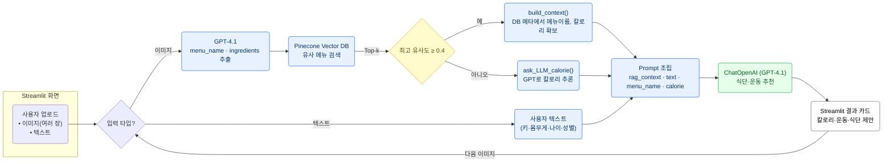

# SKN14-3rd-4Team

# 4팀: 다이어트를 위한 식단 관리 및 운동 추천 챗봇

## 1. 팀 소개
- **팀명**: GYM-PT
- **팀원**: 공지환, 김진묵, 송지훈, 이승철, 조성렬, 한성규

<table>
  <tr>
    <td align="center">
      <a href="https://github.com/0jihwan">
         
        <b>공지환</b>
      </a>
    </td>
    <td align="center">
      <a href="https://github.com/jinmukkim">
         
        <b>김진묵</b>
      </a>
    </td>
    <td align="center">
      <a href="https://github.com/teolex">
         
        <b>송지훈</b>
      </a>
    </td>
    <td align="center">
      <a href="https://github.com/ezcome-ezgo">
         
        <b>이승철</b>
      </a>
    </td>
    <td align="center">
      <a href="https://github.com/csr1968">
         
        <b>조성렬</b>
      </a>
    </td>
    <td align="center">
      <a href="https://github.com/Seonggyu-Han">
         
        <b>한성규</b>
      </a>
    </td>
  </tr>
</table>

## 2. 프로젝트 개요

### 프로젝트 소개
**‘다이어트를 위한 식단 관리 및 운동 추천 챗봇[GYM-PT]’은 인공지능 기반으로, 바쁜 현대인도 효율적으로 올바른 식단과 운동 습관을 관리할 수 있도록 설계된 통합 헬스케어 솔루션입니다.**

이 시스템은 음식 사진 또는 간단한 텍스트 입력만으로 칼로리, 영양 성분, 재료 정보를 자동 제공하며, 공식 데이터베이스와 연동해 신뢰성 있는 정보를 빠르게 제공합니다. 대화형 챗봇은 사용자별 목표와 상황에 맞는 운동 루틴을 안내하여 시간과 비용 부담을 줄이고 누구나 지속가능한 건강관리를 실천할 수 있도록 지원합니다.

본 프로젝트는 복잡한 건강관리 과정을 간소화하고, 사용자 중심의 맞춤형 데이터 기반 안내를 통해 실생활에서 자기관리와 삶의 질 향상에 기여하는 것을 목표로 합니다.

### 개발 배경 및 필요성

빠르게 변화하는 라이프스타일, 도시화, 바쁜 일정, 정보 접근성 한계 등으로 건강 습관 유지가 점점 더 어려워지고 있습니다. 많은 사람들이 시간·비용의 제약, 부정확한 건강 정보, 운동시설 부족, 동기 저하 등으로 식단 관리와 규칙적 운동 실천이 어렵습니다.

그 결과 운동 부족과 영양 불균형 문제가 심각해지고 만성질환과 사회적 부담도 커지고 있습니다. 누구나 쉽게 접근 가능한 신뢰 있는 정보와, 개인 환경과 목표에 맞춘 건강 관리가 필요합니다.

**[GYM-PT]는**
- 바쁜 일상과 시간·비용의 제약 속에서도 **간편하게 식단 정보와 운동 추천**을 제공하며,
- **지속 가능한 건강관리 습관** 형성,  
- **만성 건강 문제 예방과 삶의 질 향상**에 실질적으로 기여하고자 개발됐습니다.

---

## 3. 기술 스택 및 모델

| **Frontend** | **Backend** | **LLM Model** | **Vector DB** | **Collaboration Tool** |
|:---:|:---:|:---:|:---:|:---:|
|  |     |     |  |           |

  

---

## 4. 주요 기능

1. **메인 페이지 사용 안내**
    - 프로젝트 사용법, 개인정보 입력, 챗봇 활용, AI 분석 절차 등 직관적 안내

2. **개인정보 입력(사이드바)**
    - 키, 몸무게, 성별, 나이 입력
    - 입력값 기반 맞춤형 추천

3. **챗봇 프롬프팅 및 상호작용**
    - 텍스트 또는 이미지 기반 자유로운 질의
    - 건강, 식단, 운동 Q&A
    - 음식 이미지 업로드 시 AI가 질문·이미지 모두 분석하여 답변

4. **AI 기반 식단·운동 추천 및 정보 제공**
    - 입력 정보를 종합 분석해 맞춤형 식단관리, 운동 루틴, 음식정보(칼로리, 영양, 재료), 생활습관 등 다양한 답변

5. **맞춤형 문서 생성 및 편의성**
    - 사용자 정보 바탕 식단·운동 플랜 문서 제공
    - 사용성 높은 인터페이스

---

## 5. 전체 워크 플로우

<aside>
💡 **주제 : LLM 을 연동한 내외부 문서 기반 질의 응답 시스템**

| 목표 | 내용 |
| --- | --- |
| · 환각을 방지하고 원하는 내외부 데이터 내에서 RAG 기반 LLM 활용 질의 응답 시스템 구현
· 문서를 벡터 형태로 임베딩하여 벡터데이터 베이스에 저장 및 검색
· LangChain을 활용하여 벡터데이터베이스와 LLM 연동 배포 | · 데이터 수집 및 가공
· 벡터 데이터베이스 생성 및 데이터 저장
· One-shot 또는 Few-shot 활용 프롬프트 탬플릿 작성
· 사용할 LLM 인공지능 모델 선택
· LangChain 활용 RAG 기술로 벡터데이터 베이스와 LLM 연동하여 질의응답 구현
· 구현 결과 테스트 및 개선  |

**산출물**

- 수집된 데이터 및 데이터 전처리 문서
- 시스템 아키텍처
- RAG 기반 LLM과 벡터 데이터베이스 연동 구현 코드
- 테스트 계획 및 결과 보고서

---

## 6. 시연 영상
(작성 예정)

---

## 7. 추후 발전 계획

### 맞춤형 서비스 고도화
- 운동·식단 추천 알고리즘 개선(연령/목표/신체 조건/알레르기 등 반영)
- 개별 체성분 및 목표 변화 추적, 간편한 식단·운동·신체변화 기록

### 사용자 경험 및 플랫폼 확장
- 모바일 및 앱 통합, Push 알림
- 스마트워치·웨어러블 기기 연동
- 다국어 지원(영어·일어 등 다양한 음식문화 고려)

### 인공지능·정보 신뢰성 강화
- 이미지·텍스트 멀티모달 분석 고도화
- 실시간 DB/외부 자료(RAG) 자동 업데이트
- 음성 챗봇, 운동 영상 등 접근성 강화
- 칼로리뿐만 아니라 영양성분(탄단지, 나트륨, 기타 미량영양소 등)까지 상세 분석 기능 확장

### 피드백을 통한 문제 개선

- 사용자의 서비스 이용 경험, 불편사항, 개선 요청 등 다양한 피드백 수집 및 분석

---

